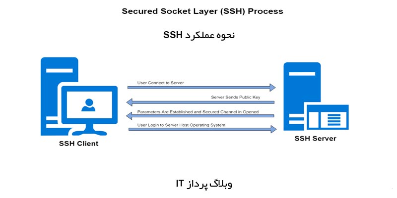

% OpenSSH
% Golestani
% 1399/12/12

# Slide 1 رمزنگاری متقارن و نامتقارن

متقارن
* در متد رمزنگاری به شیوۀ متقارن فرستنده و گیرنده از یک کلید مشترک برای رمزگذاری و رمزگشایی داده استفاده می کنند.
* تمام رمزنگاری های کلاسیک از نوع متقارن هستند.
* تا قبل از دهه 70 تنها نوع رمزنگاری به حساب می آمد.
* مثل: DES،3DES و AES

نیازمندی های استفاده امن از رمزنگاری متقارن
* وجود یک الگوریتم رمزنگاری قوی
* وجود یک کلید سری که تنها فرستنده و گیرنده از آن آگاه باشند.
* فرض بر آن است که الگوریتم برای همه مشخص می باشد، بنابراین نیاز به یک کانال امن برای توزیع کلید است.

نامتقارن
* برخلاف رمزنگاری متقارن در رمزنگاری به شیوه نامتقارن از یک جفت کلید عمومی (Public Key) برای رمزگذاری و حفظ محرمانی و کلید خصوصی (Private Key) جهت رمزگشایی استفاده می‌ شود که یک رابطه ریاضی بین آن ها وجود دارد.
* مثل: RSA،DH و DSA
* استفاده از الگوریتم ها asymmetric پردازش زیادی را برای CPU در زمان رمزنگاری و رمزگشایی داده ایجاد می کند. به همین خاطر بجای استفاده از این روش برای رمزنگاری کل اطلاعات، در مراحل خاصی از ارتباط (مانند authentication) استفاده می شود.
* یکی از دلایلی که این روش را رمزنگاری public key می نامند این می باشد که ما این کلید را به صورت عمومی در اختیار همه قرار می دهیم. کلید دیگری که در این روش استفاده می شود private key نامیده می شود و این کلید در اختیار کسی قرار نمی گیرد و مخصوص خود دستگاه است.

# Slide 2 احراز هویت مبتنی بر SSH key

* جفت کلید SSH دو کلید رمزنگاری امن است که می تواند برای تأیید هویت یک مشتری به یک سرور SSH مورد استفاده قرار گیرد. هر جفت کلیدی شامل یک کلید عمومی و یک کلید خصوصی است.
* کلید خصوصی توسط مشتری حفظ می شود و باید کاملا مخفی نگه داشته شود. هرگونه در معرض خطر قرار دادن کلید خصوصی به hacker اجازه می دهد تا به سرورهایی که با کلید عمومی مربوطه پیکربندی شده اند بدون احراز هویت اضافی وارد شوند. میتوان کلید خصوصی را روی دیسک رمزگذاری شده نگهداری کرد.
* کلید عمومی را می توان بدون هیچ گونه عواقب منفی آزادانه به اشتراک گذاشت. کلید عمومی پیام ها را رمزگذاری میکند بطوری که تنها با کلید خصوصی می توان رمزگشایی کرد. از این ویژگی به عنوان راهی برای اعتبار سنجی با استفاده از جفت کلید استفاده می شود.
* کلید عمومی در ریموت سروری آپلود می شود که می خواهید با SSH وارد شوید.
* شما یک کلید عمومی و خصوصی دارید که می توانید برای authenticate از آن استفاده کنید.
کپی کلید عمومی در سرور
* کپی کردن کلید عمومی با استفاده از SSH-Copy-ID
	* ابزار ssh copy-id در بسته های OpenSSH در بسیاری از توزیع ها موجود است، بنابراین شما می توانید آن را در سیستم خود در دسترس داشته باشید. برای کار، شما باید دسترسی SSH مبتنی بر رمز ورود به سرور خود داشته باشید.
* کپی کردن کلید عمومی با استفاده از SSH
	* اگر ssh copy-id در دسترس نیست ولی دسترسی SSH مبتنی بر رمز عبور را بر روی یک حساب کاربری در سرور خود دارید، می توانید کلیدهای خود را با استفاده از SSH آپلود کنید.
* کپی کلید عمومی به صورت دستی
	* اگر شما دسترسی SSH مبتنی بر رمز عبور را در دسترس نداشته باشید، باید فرایند فوق را به صورت دستی انجام دهید.
	* حتوای فایل id_rsa.pub شما باید به فایل در authorized_keys در دستگاه ریموت اضافه شود.
	* برای نمایش محتویات کلید id_rsa.pub خود، این را به کامپیوتر محلی خود وارد کنید
* با استفاده از کلیدهای SSH به سرور خود لاگین کنید
	* اگر قبلا یکی از روشهای فوق را تکمیل کرده باشید، باید بتوانید بدون داشتن رمز عبور حساب کاربری سرور ریموت وارد آن سیستم شوید.
	
# Slide 3 عملکرد SSH در فراهم کردن یک بستر امن ارتباطی

SSH هم به پروتکل شبکه رمزنگاری و هم به مجموعه سرویس های اجرا کننده پروتکل اشاره دارد و از یک مدل سرویس گیرنده-سرویس دهنده استفاده می کند. SSH همچنین می تواند برای ایجاد تونل های امن برای سایر پروتکل های کاربردی، به عنوان مثال، برای اجرای جلسات گرافیکی X Window System از راه دور استفاده شود. اما پورت SSH چیست ؟ سرور SSH به طور پیش فرض، پورت 22 پروتکل کنترل انتقال (TCP) را گوش می دهد.
در حالی که می توان از SSH با شناسه کاربری و رمزعبور معمولی به عنوان اعتبار استفاده کرد، SSH برای تأیید اعتبار میزبان به یکدیگر، بیشتر به جفت های کلید عمومی متکی است. بدین صورت که کاربران باید از شناسه کاربری و رمزعبور خود (یا سایر روشهای تأیید اعتبار) برای اتصال به “میزبان از راه دور” استفاده کنند. علاوه بر این دستگاه محلی و دستگاه از راه دور به صورت جداگانه به یکدیگر احراز می شوند. این کار با تولید یک جفت کلید عمومی منحصر به فرد برای هر میزبان در ارتباطات انجام می شود. یک جلسه واحد به دو جفت کلید عمومی نیاز دارد: یک جفت کلید عمومی برای تأیید اعتبار دستگاه از راه دور به دستگاه محلی و یک جفت کلید عمومی دیگر برای تأیید اعتبار دستگاه محلی به دستگاه از راه دور.
اتصالات SSH برای تأمین امنیت انواع مختلف ارتباطات بین یک دستگاه محلی و یک میزبان از راه دور، از جمله دسترسی ایمن از راه دور به منابع، اجرای از راه دور دستورات، تحویل وصله های نرم افزاری و به روزرسانی ها و سایر کارهای اداری یا مدیریتی مورد استفاده قرار گرفته است.

